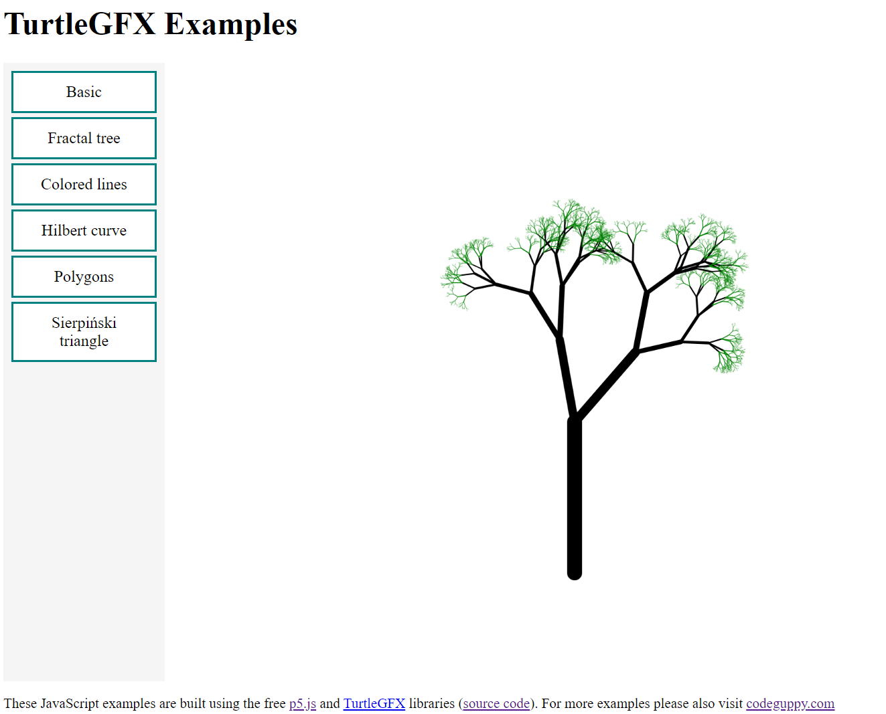
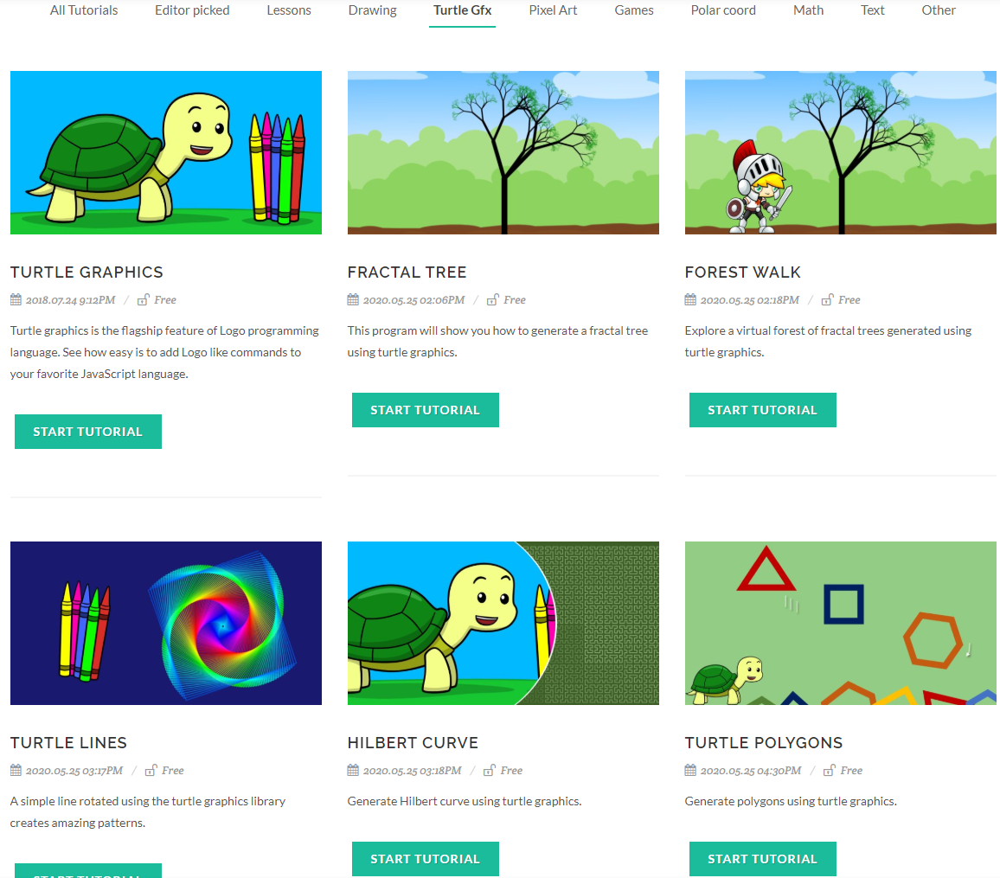

# What is TurtleGFX?

In a nutshell this library allows to code with 🐢 Turtle Graphics in JavaScript.

TurtleGFX is add-on for [p5.js](https://p5js.org/) library.
TurtleGFX extends the JavaScript based p5.js library with  Turtle Graphics drawing primitives.

Turtle Graphics is great for both education and creative coding.

When used in education, teachers and educators, usualy find that Turtle Graphics offers a gently introduction to programming to young kids.

In addition, with Turtle Graphics is very good at presenting some advanced concepts such as recursion.

# Features

Library supports two modes:

- *Easy Mode* / *Default turtle mode*. This is the default mode. In this mode users can work directly with the global TurtleGFX API such as: forward(), left(), right(), etc.

- *Multiple turtles mode*. In this mode users can create multiple turtles on the screen ( let turtle = createTurtle(); turtle.forward(); etc. );

The API has been designed to be closely compatible with popular Turtle Graphics libraries from other languages, such as Python / Logo. In this way you can easily port programs from those languages to JavaScript.

For API reference please consult the [turtlegfx.js](lib/turtlegfx.js) code.

# Examples

There are several examples included with this library. Please refer to the source code of `ex-____.html` files for details.

The online version of these examples is available at:
[https://codeguppyprograms.github.io/TurtleGFX/index.html](https://codeguppyprograms.github.io/TurtleGFX/index.html)

# License

This library is offered under [CC BY 2.0](https://creativecommons.org/licenses/by/2.0/) license by [codeguppy.com](https://codeguppy.com) - the p5.js based coding site for kids, teens and creative adults!

Feel free to use TurtleGFX in your p5.js sketches!

# Notes

TurtleGFX is also built-in into [codeguppy.com](https://codeguppy.com)

Some of the examples included with TurtleGFX are also available on codeguppy.com under TurtleGFX libray:

For feedback and suggestions please tweet [@codeguppy](https://twitter.com/codeguppy)

Happy coding!
